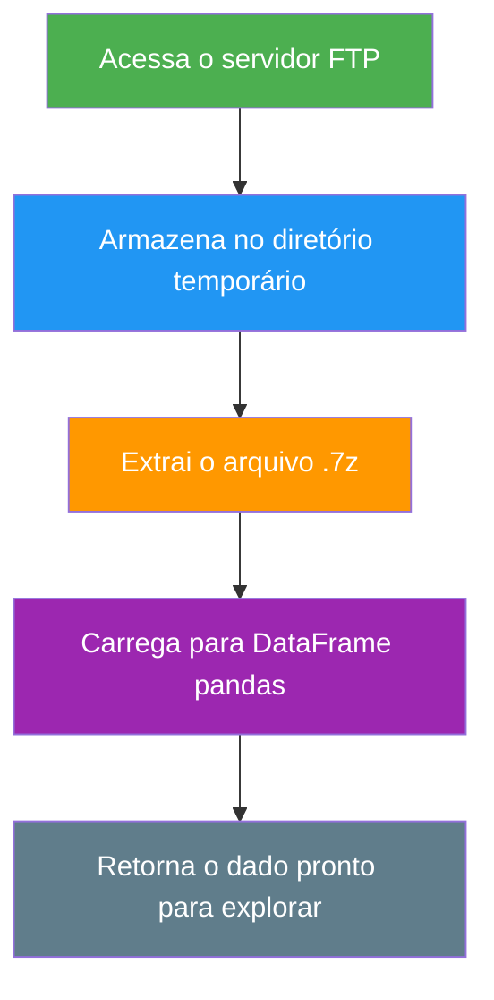

# Ingestão de dados em Python (ETL)


## Sobre o projeto
Este projeto tem o objetivo de demonstrar um processo simples de ETL dos microdados [`RAIS`](https://www.gov.br/trabalho-e-emprego/pt-br/assuntos/estatisticas-trabalho/o-pdet/o-que-e-rais#:~:text=O%20que%20%C3%A9%20RAIS?,-RAIS%20%2D%20RELA%C3%87%C3%83O%20ANUAL&text=A%20RAIS%20%C3%A9%20um%20Registro,entidades%20governamentais%20da%20%C3%A1rea%20social.),
disponibilizados em um servidor FTP do Ministério do Trabalho. Como os dados são abertos e 
de interesse público, o link e as instruções de como acessá-lo podem ser encontrados [aqui.](https://www.gov.br/trabalho-e-emprego/pt-br/assuntos/estatisticas-trabalho/microdados-rais-e-caged) 
Todo o processo foi construído na linguagem Python e o código pode ser acessado [aqui](/python_scripts/data_ingestion_ftp_server.ipynb)


## Descrição do projeto
No projeto é definida uma função que lê os dados RAIS, — Referente aos vínculos públicos apenas do estado de São Paulo — cria um diretório temporário para armazenar e posteriormente descompactar esses dados — Pois os dados se encontram compactados em formato 7z — para em fim retorná-los em um DataFrame pandas para futura análise. 

**Exemplo de como chamar a função**
```python
# Chamando a função:
df = extract_rais_data(url="ftp://ftp.mtps.gov.br/pdet/microdados/RAIS/2024/RAIS_VINC_PUB_SP.7z", nrows=1000, cols=["col1", "col2"])

# Checando as primeiras linhas do DataFrame:
df.head()
```

**Passos do ETL:**



## Lista das Dependências
Entre as dependências listadas abaixo, algumas não são padrões do Python, ou seja, necessitam instalação para que sejam importadas e utilizadas.

*Depencias principais:*
- `pandas >= 2.0`
- `py7zr >= 1.0`

*Dependências padrões*
- `os`
- `temfile`
- `urllib`


## Descrição da Função
- parâmetros:
  - url - parâmetro recebe o link do arquivo a ser lido no servidor FTP.
  - nrows - parâmetro recebe valores do tipo int e define o número de linhas dos dados.
  - cols - Recebe argumento list-like com as variáveis/colunas desejadas.

- Objeto da função:
  - A função começa acessando os dados do servidor ftp através da dependência urllib e armazenado em uma variável.
  - Posteriormente é criado um diretório temporário com a dependência tempfile onde será realizado todo processo de               armazanamento e descompactação desses dados.
  - A descompactação é então realizada no diretório temporário pela dependência py7zr e logo após disponibiliza os dados          armazenados em uma variável já descompatados, a variável é utilizada como argumento da função pandas read_csv para que        seja retornado o DataFrame pandas.

- Lidando com erros:
  - A função possui dois blocos com try-except, o primeiro verifica e lida com erros caso o arquivo extraído não seja um arquivo csv.
  - O segundo verifica a codificação do arquivo, caso não seja um UTF-8 é feita uma nova tentativa com o codificação ISO-8859-1.

## Exemplo de output:

Abaixo um screenshot que demonstra a função retornando o DataFrame e que pode posteriormente ser explorado para mitigar respostas e criar iniciativas públicas baseadas nos   insights destes dados.
  

